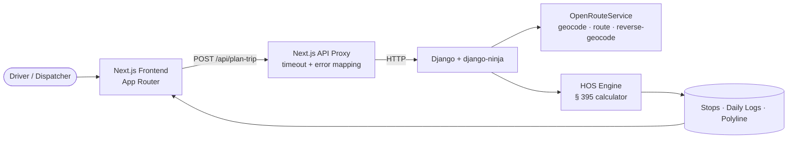

# ELD Trip Planner

An FMCSA-compliant trip planner for property carriers on the 70-hour / 8-day cycle. Computes legal routes with Hours of Service stops and renders Driver's Daily Log sheets per **49 CFR § 395**.

---

## Architecture



## Stack

**Backend** &nbsp; Django 5 · django-ninja · httpx · OpenRouteService · Python 3.11+
**Frontend** &nbsp; Next.js 15 (App Router) · React 19 · TypeScript · Leaflet · Mantine

---

## Quick Start

### Prerequisites
- Python 3.11+
- Node 20+
- A free [OpenRouteService API key](https://openrouteservice.org/dev/#/signup)

### Backend
```bash
cd Backend
python -m venv .venv && source .venv/bin/activate
pip install -r requirements.txt
cp .env.example .env          # then fill in ORS_API_KEY
python manage.py runserver
```
Runs on **http://localhost:8000**.

### Frontend
```bash
cd frontend
npm install
echo "BACKEND_URL=http://localhost:8000" > .env.local
npm run dev
```
Runs on **http://localhost:3000**.

---

## Demo Trip

| | |
|---|---|
| Current | Chicago, IL |
| Pickup | St. Louis, MO |
| Dropoff | Dallas, TX |
| Cycle used | 0 hr |

→ 971 mi · 22.3 drive hours · 3 daily log sheets · pickup, fuel, two 10-hr sleeper rests, dropoff.

---

## HOS Rules Implemented

Property carrier, 70-hour / 8-day cycle. No adverse conditions, no sleeper-berth split (§ 395.1(g)).

| Rule | Limit | Reference |
|---|---|---|
| Max driving per shift | 11 hr | § 395.3(a)(3)(i) |
| Driving window | 14 hr from shift start | § 395.3(a)(2) |
| Mandatory break | 30 min after 8 cumulative drive hr | § 395.3(a)(3)(ii) |
| Reset between shifts | 10 hr off-duty / sleeper | § 395.3(a)(1) |
| Cycle limit | 70 hr in 8 days | § 395.3(b) |
| Restart | 34 consecutive hr off-duty | § 395.3(c) |
| Fuel stop | Every 1000 mi (assumption) | — |
| Pickup / Dropoff | 1 hr on-duty each (assumption) | — |

The 30-min break is logged as off-duty. The 10-hr reset and 34-hr restart are logged as sleeper berth, reflecting OTR practice on multi-day hauls.

---

## Tests

```bash
cd Backend
python tests/test_hos_engine.py
```

**202 assertions** covering: cycle exhaustion mid-segment, dropoff-window breach, fuel and break interaction, multi-day restart spans across calendar boundaries, segment contiguity, ISO 8601 datetime formatting, and edge cases at the 11/14/70 hour limits.

---

## Project Structure

```
Backend/
├── api/                  # business logic + routing
│   ├── hos_engine.py         # § 395 calculator
│   ├── ors_client.py         # geocode · route · reverse-geocode
│   ├── router.py             # POST /plan-trip · GET /autocomplete
│   └── schemas.py            # pydantic request/response types
├── core/                 # Django settings + ASGI/WSGI
├── tests/                # standalone test runner
└── manage.py

frontend/
├── app/                  # Next.js routes
│   ├── api/              #   server-side proxies to Backend
│   │   ├── plan-trip/route.ts
│   │   └── autocomplete/route.ts
│   ├── layout.tsx
│   └── page.tsx
└── components/
    ├── EldLogSheet.tsx       # canvas log renderer
    ├── LocationAutocomplete.tsx
    ├── LogPaginator.tsx
    ├── RouteMap.tsx          # Leaflet route + stop markers
    ├── TripForm.tsx
    ├── TripSummary.tsx
    └── types.ts
```

---

## References

- **[FMCSA HOS Driver's Guide (2022)](https://www.fmcsa.dot.gov/sites/fmcsa.dot.gov/files/2022-04/DriversGuidetoHOS_2022_FINAL_compliant.pdf)** — § 395 rules with worked examples
- **[eCFR Title 49, Part 395](https://www.ecfr.gov/current/title-49/subtitle-B/chapter-III/subchapter-B/part-395)** — full regulatory text
- **[FMCSA Summary of HOS Regulations](https://www.fmcsa.dot.gov/regulations/hours-service/summary-hours-service-regulations)** — quick-reference page
- **[OpenRouteService API docs](https://openrouteservice.org/dev/#/api-docs)** — routing, geocoding, reverse-geocoding
- **Drivers Daily Log form** — derived from the standard DOT log template (24-hour grid, 4 duty status rows, remarks zone)

---

## Notes & Limitations

- **Time zone** — all calculations use the server's local time anchored to calendar midnight on Day 1. Cross-zone trips are not adjusted; FMCSA expects driver's home-terminal time.
- **Sleeper-berth split (§ 395.1(g))** — not implemented. The 10-hr reset is taken as a single block.
- **Adverse conditions (§ 395.1(b))** — not implemented. Daily limits are hard caps.
- **Routing** — uses OpenRouteService `driving-hgv` profile (heavy-goods vehicle). Routes respect truck restrictions where ORS data is available.

---
